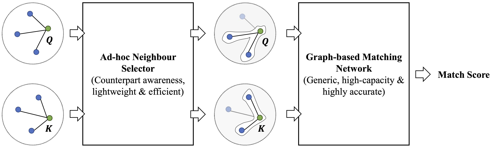

# CDSM: Cascaded Deep Semantic Matching on Textual Graphs Leveraging Ad-hoc Neighbor Selection
paper link: https://arxiv.org/abs/xxxx

## Introduction
For deep semantic matching on textual graphs, we empirically find that the neighbor features could be highly noisy and partially useful. In this paper, we propose a novel framework, Cascaded Deep Semantic Matching (CDSM), which works in a two-stage workflow for accurate and efficient semantic matching on textual graphs. In the first stage, a lightweight CNN-based ad-hod neighbor selector is deployed to filter useful neighbors for the matching task with a small computation cost. In the second stage, a high-capacity graph-based matching network is employed to compute fine-grained relevance scores based on the well-selected neighbors. It is worth noting that CDSM is a generic framework which accommodates most of the mainstream graph-based semantic matching networks. To cope with the major challenge how the selector can learn to discriminate the neighbors' usefulness which has no explicit labels, we design a weak-supervision strategy for optimization, where we train the graph-based matching network at first and then the ad-hoc neighbor selector is learned on top of the annotations from the matching network. Extensive experiments on three benchmark datasets demonstrate that CDSM notably improves the semantic matching accuracy and efficiency.



## Requirements
+ python 3.7
+ numpy 1.21.6
+ torch 1.9.0
+ transformers 4.2.1

## Quick Usage
1. Download the processed data from xxx and put them into the data folder.

2. Download the pretrained checkpoint from xxx and put them into the checkpoint folder.

3. Evaluate the model result, all running arguments are set in the main_xxx.py script.
```
cd src
python main_predictor.py
```

## Training Process
Taking the training process of the TextGNN-GAT implementation as an example, the training process of other backbones is the same.

1. Train the backbone semantic matching model.
```
cd src/train_backbone
python main_gat.py
```

2. Generate weak supervision data for the selector with the trained matching network.
```
cd src
python main_evaluator.py
```

3. Train the selector.
```
cd src
python main_selector.py
```

4. Evaluate the result with neighbor selection under our CDSM framework.
```
cd src
python main_predictor.py
```

## Citation